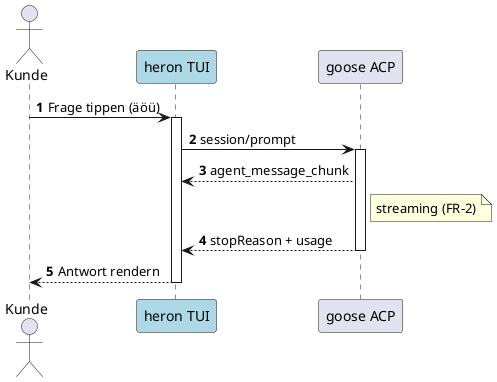

```plantuml
@startuml
autonumber
actor Kunde as K
participant "heron TUI" as H #lightblue
participant "goose ACP" as G
K -> H : Frage tippen (äöü)
activate H
H -> G : session/prompt
activate G
G --> H : agent_message_chunk
note right of G : streaming (FR-2)
G --> H : stopReason + usage
deactivate G
H --> K : Antwort rendern
deactivate H
@enduml
```
